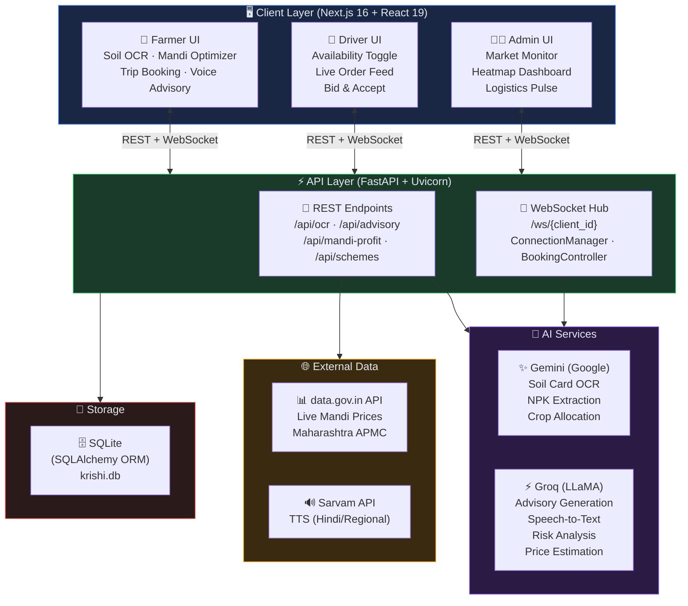
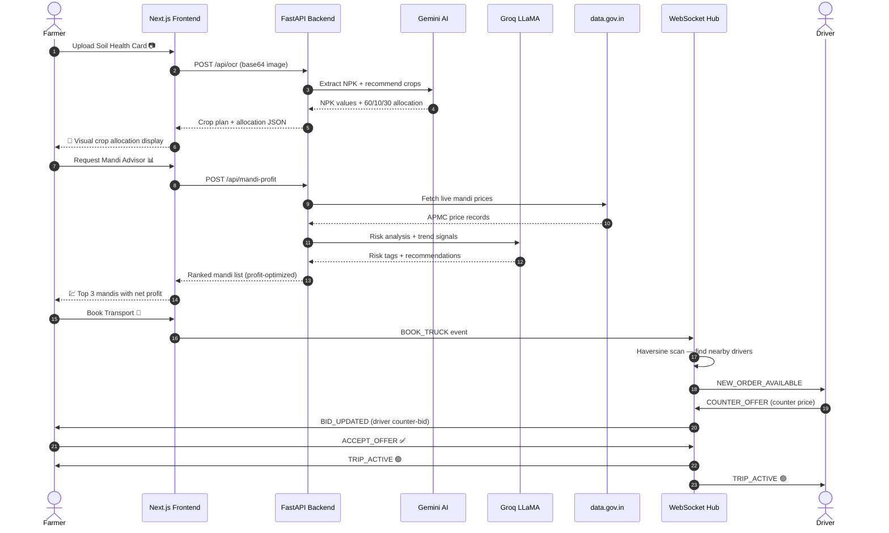
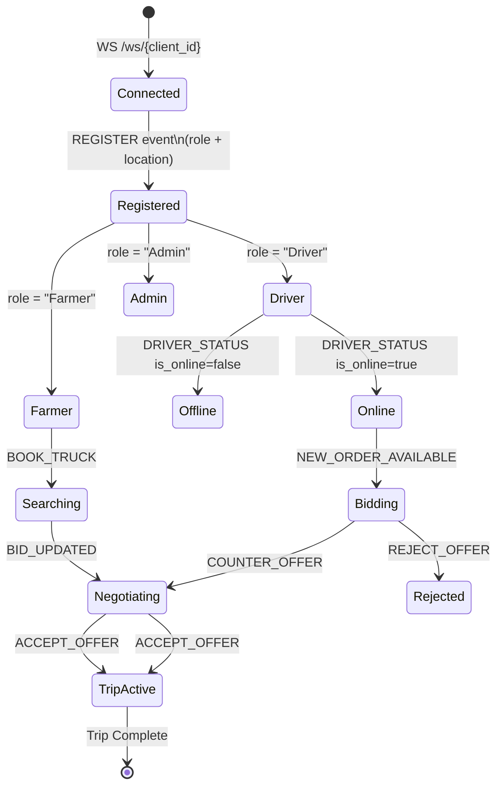
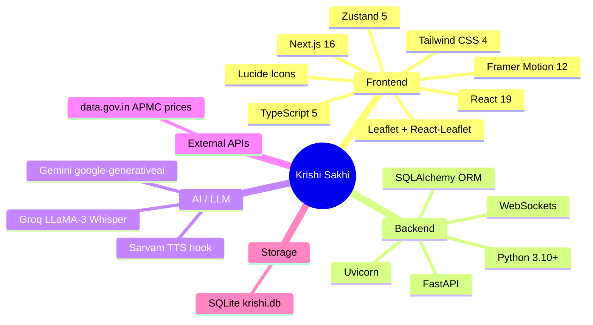
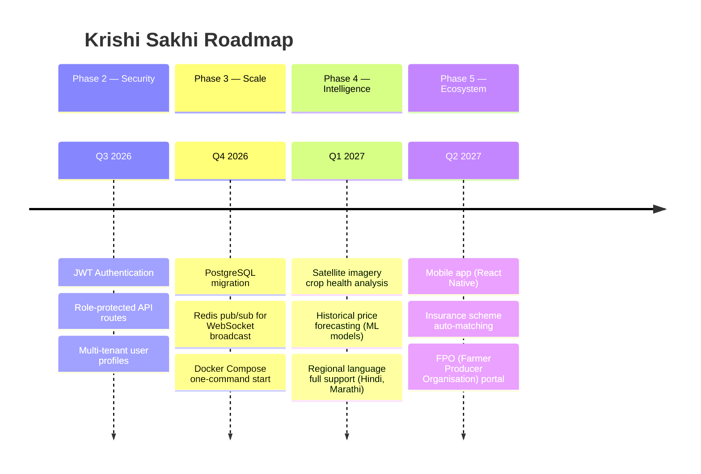

<div align="center">


<br/>

<p>
  
  
  
  
  
  
  
  
</p>

<p>
  <strong>One platform. Three roles. Zero friction.</strong><br/>
  From Soil to Sale — AI-driven crop planning, mandi profit optimization, and real-time logistics dispatch built for India's farming ecosystem.
</p>


</div>

<br/>

## 📖 Table of Contents

- [🌟 What is Krishi Sakhi?](#-what-is-krishi-sakhi)
- [🎯 The Problem We Solve](#-the-problem-we-solve)
- [🏗️ System Architecture](#️-system-architecture)
- [🔄 Data Flow Diagram](#-data-flow-diagram)
- [✨ Feature Deep-Dive](#-feature-deep-dive)
- [🛠️ Tech Stack](#️-tech-stack)
- [📁 Repository Structure](#-repository-structure)
- [🚀 Quick Start](#-quick-start)
- [⚙️ Environment Variables](#️-environment-variables)
- [📡 API Reference](#-api-reference)
- [🔌 WebSocket Events](#-websocket-events)
- [🗺️ User Journey Maps](#️-user-journey-maps)
- [🔭 Future Roadmap](#-future-roadmap)
- [🤝 Contributing](#-contributing)

<br/>

---

## 🌟 What is Krishi Sakhi?

**Krishi Sakhi** (कृषि सखी — *Agriculture Friend*) is a **full-stack, AI-first platform** that bridges the gap between Indian farmers, transport drivers, and market administrators. It turns raw soil data, live market signals, and geolocation into intelligent, voice-ready decisions — all in one seamless workflow.

> 💡 *"Sakhi" means friend in Hindi — because every farmer deserves a trusted companion at every step of their journey, from sowing to selling.*

<br/>

---

## 🎯 The Problem We Solve

| Challenge | Traditional Way | Krishi Sakhi Solution |
|-----------|----------------|----------------------|
| 🌱 **Crop Planning** | Guesswork based on last year | AI reads Soil Health Cards (OCR) and gives NPK-based allocations |
| 📈 **Market Selection** | Go to the nearest mandi | Smart profit optimizer factoring fuel, spoilage, tolls & trends |
| 🚛 **Finding Transport** | Make calls, negotiate blindly | Real-time WebSocket bidding and live driver tracking |
| 📉 **Market Herding** | Everyone plants the same crop | 60/10/30 anti-herding crop allocation strategy |
| 📊 **Admin Visibility** | Paper-based regional reports | Live heatmaps, logistics pulse, and mandi health dashboards |

<br/>

---

## 🏗️ System Architecture



<br/>

---

## 🔄 Data Flow Diagram

### Farmer → Mandi Booking Pipeline



<br/>

### WebSocket Connection Lifecycle



<br/>

---

## ✨ Feature Deep-Dive

<details>
<summary><strong>🌾 Farmer Flow — Click to expand</strong></summary>

<br/>

### Step 1 · Soil Intelligence (OCR + NPK Extraction)
- Upload or capture a **Soil Health Card** image
- **Gemini AI** reads the card, extracts N/P/K values + pH
- Platform calculates **optimum crop mix** using the **60/10/30 anti-herding strategy**:
  - **60%** → Primary high-demand crop
  - **10%** → Experimental/premium crop (market diversification)
  - **30%** → Safe, stable fallback crop

### Step 2 · Mandi Profit Optimizer
- Input: crop type, quantity, fuel price, truck mileage, weather
- Platform fetches **live prices from data.gov.in** (Maharashtra APMC)
- **Groq AI** adds risk tags and trend signals per mandi
- Profit formula:
  ```
  Net Profit = (Qty × Price) − Fuel Cost − Driver Fee − Mandi Charges − Spoilage Loss
  ```
- Returns **Top 3 mandis ranked by net profit** with risk reasoning

### Step 3 · Voice Advisory (AI Chat)
- Farmer can ask questions in natural language
- **Groq LLaMA** generates contextual advice:
  - Weather-specific crop protection
  - Fertilizer timing
  - Transport scheduling
- **Speech-to-Text** via Groq Whisper API
- TTS endpoint ready (Sarvam integration hook)

### Step 4 · Live Trip Booking
- Book a truck via WebSocket event `BOOK_TRUCK`
- System auto-calculates suggested fare:
  ```
  Suggested Quote = Base Driver Fee + Fuel Cost + ₹150 buffer
  ```
- Real-time bid/counter-bid negotiation
- Live driver location on map (Leaflet)
- **Demo mode** auto-simulates driver when no live drivers are online (hackathon-friendly)

</details>

<details>
<summary><strong>🚛 Driver Flow — Click to expand</strong></summary>

<br/>

### Driver Onboarding
- Register with name, phone, and GPS location
- Toggle **Online / Offline** availability in real time

### Live Order Feed
- System uses **Haversine distance formula** to find eligible drivers within configurable radius (default 20 km)
- Driver receives `NEW_ORDER_AVAILABLE` event with:
  - Farmer name & phone
  - Crop type, weight, destination mandi
  - Estimated fuel cost & suggested price
  - Distance to pickup in km

### Bidding & Negotiation
- Counter-bid with `COUNTER_OFFER` event
- Farmer sees live bid updates
- Accept or reject with one tap
- Upon `ACCEPT_OFFER` → both parties receive `TRIP_ACTIVE` with full trip details

</details>

<details>
<summary><strong>👨‍💼 Admin Flow — Click to expand</strong></summary>

<br/>

### Market Monitor Dashboard
- Real-time overview of crop density by region
- **Heatmap-driven insights** to identify herding patterns before they cause price crashes
- Mandi health snapshots (price volatility, volume trends)

### Logistics Pulse
- Live count of online drivers vs active orders
- Regional demand-supply gap visualization
- Trip status board (SEARCHING → NEGOTIATING → ACTIVE → COMPLETE)

</details>

<br/>

---

## 🛠️ Tech Stack



| Layer | Technology | Purpose |
|-------|-----------|---------|
| **Frontend Framework** | Next.js 16 + React 19 | SSR, routing, UI rendering |
| **State Management** | Zustand 5 | Global app state (farmer/driver/admin) |
| **Map & Location** | Leaflet + React-Leaflet | Trip pickup/drop visualization |
| **Animations** | Framer Motion 12 | Micro-animations & page transitions |
| **API Layer** | FastAPI + Uvicorn | High-performance async REST + WebSockets |
| **ORM** | SQLAlchemy | Database models & session management |
| **OCR & Crop AI** | Gemini (`google-generativeai`) | Soil card reading, NPK extraction, crop allocation |
| **Advisory & STT** | Groq (LLaMA 3 + Whisper) | AI advisory, speech-to-text, mandi risk analysis |
| **Live Prices** | data.gov.in API | Real APMC mandi prices (Maharashtra) |
| **Storage** | SQLite | Local persistence (`backend/krishi.db`) |

<br/>

---

## 📁 Repository Structure

```
mini/
│
├── 🗂️ frontend/                          # Next.js 16 Application
│   ├── app/
│   │   ├── page.tsx                      # 🏠 Role selection (Farmer / Driver / Admin)
│   │   ├── farmer/
│   │   │   └── page.tsx                  # 🌾 Full farmer journey
│   │   ├── driver/
│   │   │   └── page.tsx                  # 🚛 Driver dashboard
│   │   └── admin/
│   │       └── page.tsx                  # 👨‍💼 Admin market monitor
│   │
│   ├── components/                       # Reusable UI components
│   ├── store/
│   │   └── useAppStore.ts                # Zustand global state
│   ├── lib/                              # Utilities, API client helpers
│   ├── public/                           # Static assets
│   ├── tailwind.config.ts                # Design tokens
│   └── package.json
│
└── 🗂️ backend/                           # FastAPI Application
    ├── main.py                           # ⚡ Core — REST + WebSocket + BookingController
    ├── ai_services.py                    # 🤖 Gemini + Groq integrations
    ├── models.py                         # 🗄️ SQLAlchemy models
    ├── database.py                       # 🔌 Engine + session setup
    ├── check_groq_models.py              # 🔍 Groq model inspector utility
    └── fetch_models_requests.py          # 📡 Model availability fetch helper
```

<br/>

---

## 🚀 Quick Start

### Prerequisites

| Tool | Minimum Version |
|------|----------------|
| Python | 3.10+ |
| Node.js | 18+ |
| npm | 9+ |
| Gemini API Key | [Get here](https://aistudio.google.com/app/apikey) |
| Groq API Key | [Get here](https://console.groq.com/keys) |

<br/>

### 1️⃣ Clone the Repository

```bash
git clone https://github.com/your-username/krishi-sakhi.git
cd krishi-sakhi
```

### 2️⃣ Backend Setup

```bash
cd backend

# Create and activate virtual environment
python -m venv .venv

# Windows
.venv\Scripts\activate

# macOS / Linux
source .venv/bin/activate

# Install dependencies
pip install fastapi uvicorn sqlalchemy python-multipart python-dotenv google-generativeai groq

# Set environment variables (see section below)
# Then start the server
uvicorn main:app --reload --host 0.0.0.0 --port 8000
```

✅ Backend running at → **`http://localhost:8000`**  
📖 Swagger UI → **`http://localhost:8000/docs`**

### 3️⃣ Frontend Setup

```bash
cd frontend

# Install dependencies
npm install

# Create environment file
echo "NEXT_PUBLIC_API_BASE_URL=http://localhost:8000" > .env.local

# Start development server
npm run dev
```

✅ Frontend running at → **`http://localhost:3000`**

<br/>

> **💡 One-liner full start (Windows PowerShell)**
> ```powershell
> Start-Process powershell { cd backend; .venv\Scripts\activate; uvicorn main:app --reload --port 8000 }
> Start-Process powershell { cd frontend; npm run dev }
> ```

<br/>

---

## ⚙️ Environment Variables

### Backend (`backend/.env`)

```env
# =============================================
# 🔑 REQUIRED API KEYS
# =============================================

# Gemini — Soil OCR, NPK extraction, crop allocation
GEMINI_API_KEY=your_gemini_api_key_here

# Groq — Advisory, STT (Whisper), mandi risk analysis, price estimation
GROQ_API_KEY=your_groq_api_key_here

# =============================================
# 🔧 OPTIONAL CONFIGURATION
# =============================================

# Sarvam — TTS endpoint (Hindi/regional voice output)
SARVAM_API_KEY=your_sarvam_api_key_here

# data.gov.in — APMC live mandi prices (has public fallback built-in)
DATA_GOV_API_KEY=your_data_gov_key_here

# CORS allowed origins (comma-separated)
FRONTEND_ORIGINS=http://localhost:3000
```

### Frontend (`frontend/.env.local`)

```env
# FastAPI backend base URL
NEXT_PUBLIC_API_BASE_URL=http://localhost:8000
```

<br/>

---

## 📡 API Reference

### REST Endpoints

| Method | Endpoint | Description | Auth Required |
|--------|----------|-------------|:-------------:|
| `GET` | `/` | Health check | ❌ |
| `POST` | `/api/ocr` | Soil card OCR → NPK + crop allocation | ❌ |
| `POST` | `/api/advisory` | Weather/planning advisory (text or voice query) | ❌ |
| `POST` | `/api/stt` | Speech-to-text transcription via Groq Whisper | ❌ |
| `POST` | `/api/tts` | TTS status endpoint (Sarvam hook) | ❌ |
| `POST` | `/api/mandi-profit` | Mandi profit optimizer (ranked by net profit) | ❌ |
| `POST` | `/api/schemes` | Personalized government scheme recommendations | ❌ |
| `POST` | `/api/register` | User registration stub | ❌ |

<br/>

### Sample Request — Mandi Profit Optimizer

```bash
curl -X POST http://localhost:8000/api/mandi-profit \
  -H "Content-Type: application/json" \
  -d '{
    "crop_type": "Onion",
    "crop_quantity": 20,
    "fuel_price": 96.5,
    "truck_avg": 4.5,
    "driver_fee": 1500,
    "weather": "Clear",
    "state": "Maharashtra",
    "district": "Nashik",
    "farmer_lat": 20.0059,
    "farmer_lng": 73.7898
  }'
```

**Response:**
```json
{
  "status": "success",
  "formula": "(Quantity*Price) - (Distance*Fuel) - DriverFee - MandiCharges - SpoilageLoss",
  "results": [
    {
      "mandi_name": "Lasalgaon Mandi",
      "distance_km": 43.2,
      "market_price": 2200,
      "net_profit": 38540.20,
      "risk_tag": "Low Risk",
      "trend_recommendation": "SELL_NOW",
      "is_optimal": true
    }
  ]
}
```

<br/>

---

## 🔌 WebSocket Events

Connect: `ws://localhost:8000/ws/{your-client-id}`

### 📤 Client → Server Events

| Event | Payload | Description |
|-------|---------|-------------|
| `REGISTER` | `{ role, location, is_online, name, phone }` | Register client with role & location |
| `DRIVER_STATUS` | `{ is_online, location }` | Toggle driver availability |
| `LOCATION_UPDATE` | `{ location: { lat, lng } }` | Update GPS position |
| `BOOK_TRUCK` | `{ crop, weight, mandi_name, pickup, drop, price }` | Farmer requests a truck |
| `COUNTER_OFFER` | `{ order_id, price }` | Driver submits a counter-bid |
| `ACCEPT_OFFER` | `{ order_id, driver_id, price }` | Accept a bid/offer |
| `REJECT_OFFER` | `{ order_id, driver_id }` | Reject a bid/offer |

### 📥 Server → Client Events

| Event | Recipient | Description |
|-------|-----------|-------------|
| `REGISTERED` | All | Confirms successful registration |
| `ORDER_CREATED_ACK` | Farmer | Order accepted, dispatching to drivers |
| `NEW_ORDER_AVAILABLE` | Driver(s) | Nearby farmer needs a truck |
| `BID_UPDATED` | Farmer | Driver submitted a counter-bid |
| `COUNTER_OFFER_RECEIVED` | Farmer | Counter-bid details |
| `TRIP_ACTIVE` | Farmer + Driver | Trip confirmed, full details included |
| `ORDER_CLOSED` | Losing drivers | Order accepted by another driver |
| `NO_DRIVERS_FOUND` | Farmer | No online drivers in radius |
| `DRIVER_DECLINED` | Farmer | A driver rejected the order |
| `ERROR` | Caller | Malformed event or server error |

<br/>

---

## 🗺️ User Journey Maps

### 🌾 Farmer Journey

```
[Land on /] ──► [Select: Farmer] ──► [Upload Soil Card]
                                              │
                              ┌───────────────▼────────────────┐
                              │   Gemini OCR + NPK Extraction   │
                              │   60 / 10 / 30 Crop Allocation  │
                              └───────────────┬────────────────┘
                                              │
                              ┌───────────────▼────────────────┐
                              │   Mandi Profit Optimizer        │
                              │   Live prices + Risk AI scores  │
                              └───────────────┬────────────────┘
                                              │
                              ┌───────────────▼────────────────┐
                              │   Book Transport via WebSocket  │
                              │   Bid ↔ Counter-Bid negotiation │
                              └───────────────┬────────────────┘
                                              │
                                    [TRIP_ACTIVE 🟢]
```

### 🚛 Driver Journey

```
[Land on /] ──► [Select: Driver] ──► [Register + Go Online]
                                              │
                              ┌───────────────▼────────────────┐
                              │   Receive NEW_ORDER_AVAILABLE   │
                              │   View trip details & distance  │
                              └───────────────┬────────────────┘
                                              │
                              ┌───────────────▼────────────────┐
                              │   Accept / Counter-Bid / Reject │
                              └───────────────┬────────────────┘
                                              │
                                    [TRIP_ACTIVE 🟢]
```

<br/>

---

## 🔭 Future Roadmap



| Feature | Status |
|---------|--------|
| 🔐 Auth & RBAC | 🟡 Planned |
| 🐳 Docker Compose | 🟡 Planned |
| 🗄️ PostgreSQL Migration | 🟡 Planned |
| 🧪 Automated Test Suite | 🟡 Planned |
| 📱 Mobile App (React Native) | 🔵 Roadmap |
| 🛰️ Satellite Crop Health | 🔵 Roadmap |
| 🌍 Multi-language (Hindi/Marathi) | 🔵 Roadmap |

<br/>

---

## 🤝 Contributing

Contributions, issues, and feature requests are welcome!  
Feel free to check the [issues page](../../issues) or submit a pull request.

```bash
# Fork the repo, then:
git checkout -b feature/your-feature-name
git commit -m "feat: description of your change"
git push origin feature/your-feature-name
# Open a PR 🎉
```

<br/>

---

<div align="center">


<br/>

**Built with ❤️ for India's 140 million farming families**

*Powered by Gemini · Groq · FastAPI · Next.js*

<br/>


</div>
